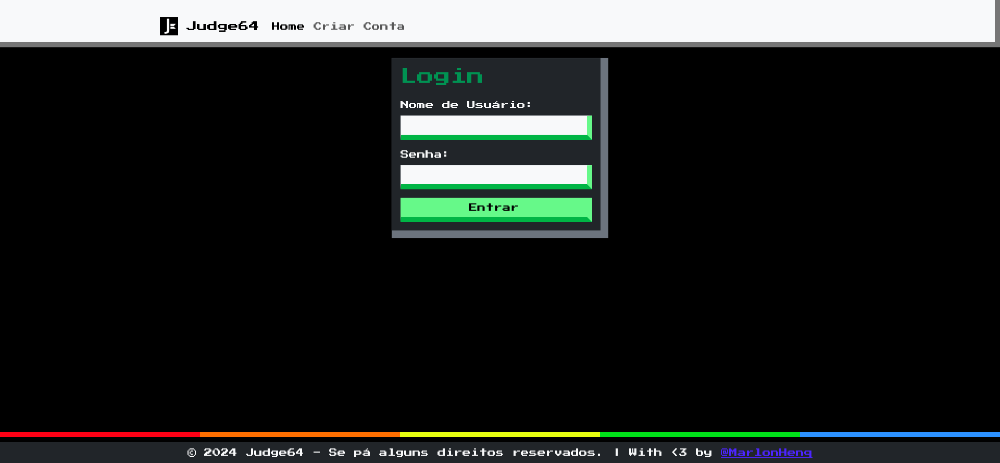

# Judge64 (old: Judge-de-Rua)

O projeto Judge64 (antigo Judge-de-rua) é um sistema de judge (avaliação) de desafios de desenvolvimento de hardware em Verilog.

Este repositório foi descontinuado, contendo os primeiros códigos da plataforma, caso queira acessar a plataforma atual acesse: [judge64.com](http://judge64.com).



O projeto tem esse antigo nome visto que a plataforma inteira foi desenvolvida com PHP sem frameworks em basicamente duas sprints (em dois dias) para a realização de um pequeno hackaton de hardware após o [Aulão de Verilog](https://www.linkedin.com/feed/update/urn:li:activity:7226317515495206912/) do [Patos - Grupo de OpenSource da UFSCar](https://patos.dev).

## Como rodar?

Primeiro você precisa copiar o arquivo `example.env` para `.env` e configurar as variáveis de ambiente.

```bash
cp example.env .env
```

Nele você deve apontar um banco de dados SQL (Recomendo MySQL ou MariaDB) que deve ser criando com o arquivo `database.sql`.

```bash
mysql -u root -p < database.sql
```

Para rodar o projeto você precisa rodar um servidor PHP apontado como raiz para a pasta `public/` do projeto.

Para desenvolvimento:
```bash
php -S localhost:8000 -t public/
```

Configuração para produção com Apache:
```apache
<VirtualHost *:80>
    ServerName judge64.local
    DocumentRoot /path/to/judge64/public

    <Directory /path/to/judge64/public>
        Options Indexes FollowSymLinks
        AllowOverride All
        Require all granted
    </Directory>
</VirtualHost>

```
PS: Não esqueça de trocar `/path/to/judge64` pelo caminho correto do projeto.

Caso você queira rodar o projeto no caminho padrão do apache (`/var/www/html/`) não se esqueça de mudar o `DocumentRoot` e o `Directory` para `/var/www/html/public`, além de dar os permissões para os diretórios `test` e `tmp`:
    
```bash
chown -R www-data /var/www/html/public/test/
chown -R www-data /var/www/html/public/tmp/
``` 

## Como contribuir?

Você pode contribuir com o projeto de formas menos diretas como:

- Reportando bugs
- Sugerindo melhorias

Para isso você pode abrir uma [issue](https://github.com/MarlonHenq/Judge64-JudgeDeRua/issues)

Agora caso você queria contribuir com código você pode fazer um fork do projeto e abrir um pull request.

Passo a passo:

1. Faça um fork do projeto
2. Clone o projeto para sua máquina
3. Crie uma branch para a sua feature (`git checkout -b feature/MinhaFeature`)
4. Faça o commit das suas alterações (`git commit -am 'Adicionando uma feature'`)
5. Faça o push para a branch (`git push origin feature/MinhaFeature`)
6. Abra um pull request
7. Aguarde a revisão 🙃🙃

## Licença

Sem licença pode brincar a vontade.
